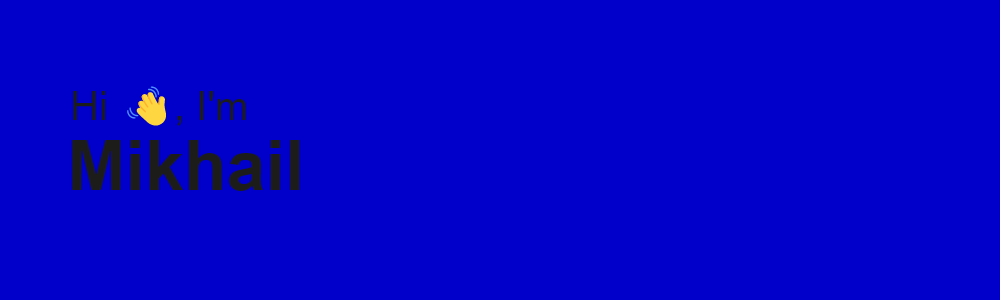

<h1 align="center">Hi there, I'm Mikhail</h1>
</h1>
<h3 align="center">I'm first-year student of Siberian State University Of Telecommunications and Information Science 🇷🇺</h3>

____

- 👋 Привет, я **@Miahasik**
- 👀 Увлекаюсь **Python** разработкой
- 🌱 В данный момент веду проект по разработке **бота для ВК на Python**
- 📫 Чтобы связаться со мной, пишите в телеграмм: **@Maziash**

____
<h2 align="center">Languages</h3>

 

____

<h2 align="center">Stats</h3>

____

<h2 align="center">Socials</h3>

  
